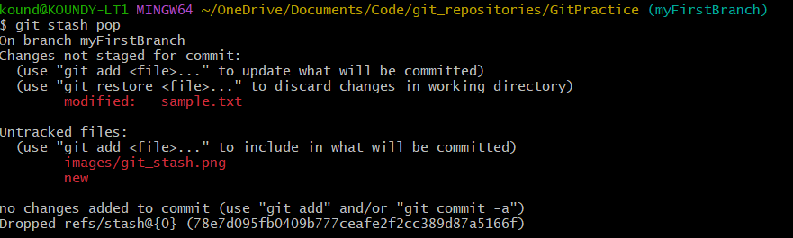

# git-practice

This repository contains a few practice assignments on git. 
First, setup git and create a github account as explained in the slides. 

Execute the following steps to practice various topics covered in the intro to git session 
# 1) Forking a repository 
   Fork the repository using the fork icon.   
   
    

# 2) Cloning a forked repository 
   Clone the forked repository into a directory of your choice in your local machine using the command `git clone <url_of_forked_repository>`    
   
    

# 3) Branching
   Create a branch with name myFirstBranch using the command `git branch myFirstBranch`    
   
    

# 4) Switching to a new branch
   Now switch to the new branch using the command `git checkout myFirstBranch`    
       
   As shown in the above image, the branch gets changed from main to my first branch  
    

   # Note : 
   The above two steps can be performed at once by using the command `git checkout -b "myFirstBranch"`. This command creates a new branch with the name specified in the quotes and switches to that branch.
    

# 5) Making changes
   Add a sentence of your choice to the sample.txt file. (Ex : Hi I am <your_name>)  
   Add a new text file named new.txt  
   This is how the cloned repository on your local machine should look after doing the above two changes    
   
    

# 6) Checking the difference 
   Now, use the commands `git status` and `git diff` and see what happens    
       
   The above image says that the new sentence added to the file sample.txt is unstaged. It means that those changes are in git but they are not marked for commit.  
   But, the newly added file new.txt is untracked. This means that this file is not in git and any changes made to it won't be recognized by git  
       
   When we perform `git diff`, it does not show new.txt. This is because new.txt is still untracked.
    

# 7) Stashing your changes
   Now use the command `git stash` followed by `git status`.    
       
   This command is used when we want to have a clean working directory but at the sametime save our changes. All the tracked work gets saved, but the untracked changes remain as it is and they wont be saved.  
   Carefully observe the difference between the current and the previous output of `git status`.  
    Now use the command `git stash pop`    
        
    As we can see, all our changes are back.
    

# 8) Stashing untracked changes
   Now use the command `git stash -u` followed by `git status`.    
       
    This time it even stashes the untracked file.
    Now again, use the command `git stash pop`. You will be able to see both the tracked and untracked changes.
    

# 9) Staging the changes
   Use the command `git add --all` to stage all the changes    
   
  Again use the commands `git status` and `git diff` and see what happens    
   
       
   Since all our changes have been staged, `git diff` does not show anything.
    

# 10) Committing changes
   Now, commit the changes using `git commit -m "my first commit"`    
   
     

# 11) Merging branches
   Switch to the main branch by using the command `git checkout main`    
       
   As shown in the above image, the branch changes from myFirstBranch to main  
   Now merge the other branch with main branch using `git merge myFirstBranch`    
       
      

# 12) Tracking upstream repository
   Use the command `git remote -v` to see all the tracked github repositories    
       
   As shown in the image, it only tracks the forked repository  
   Use the command `git remote add upstream <url_of_upstream_repo>` to track the upstream repo as well. Then again use the command `git remote -v` to check if the upstream is being tracked.   
   
     

# 13) Pushing changes
   Now push all the changes onto your forked github repository using `git push origin main`
       
 
 Open your forked github repository and check whether all the changes have been updated.
 

