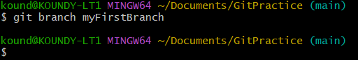
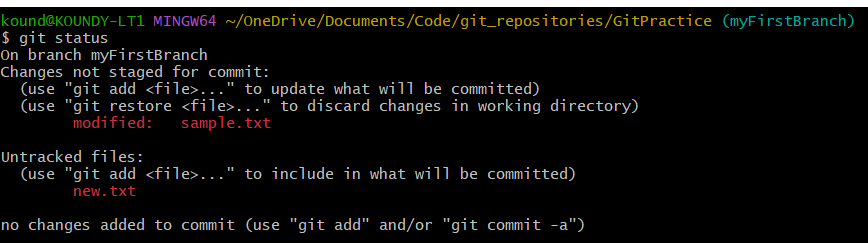
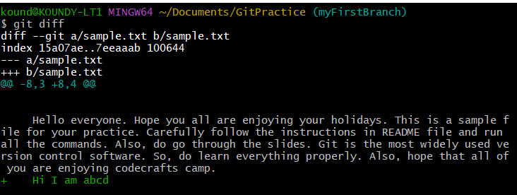
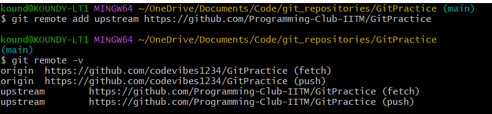
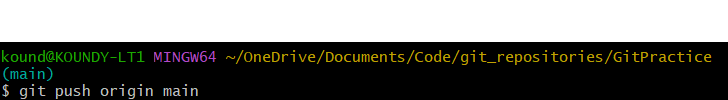

# git-practice

This repository contains a few practice assignments on git. 
First, setup git and create a github account as explained in the slides. 

Execute the following steps to practice various topics covered in the intro to git session 
1) Fork the repository using the fork icon. 
   
2) Clone the forked repository into a directory of your choice in your local machine using the command git clone <url_of_forked_repository>  
   
3) Create a branch with name myFirstBranch using the command git branch  
   
4) Now switch to the new branch using the command git checkout myFirstBranch 
     
   As shown in the above image, the branch gets changed from main to my first branch  
   Note : The above two steps can be performed at once by using the command git checkout -b "myFirstBranch". This command creates a new branch and switches to that branch.  
5) Add a sentence of your choice to the sample.txt file. (Ex : Hi I am <your_name>)  
6) Add a new text file named new.txt  
   This is how the cloned repository on your local machine should look after doing the above two changes  
   
7) Now, use the commands git status and git diff and see what happens  
   
     
   When we perform git diff, it does not show new.txt. This is because new.txt is still untracked.  
8) Now use the command git stash followed by git status.  
     
   The untracked file did not get stashed  
9) Now use the command git stash pop  
     
10) Now use the command git stash -u followed by git status.  
      
    This time it even stashes the untracked file.  
11) Now again, use the command git stash pop. You will be able to see both the tracked and untracked changes. 
12) Use the command git add --all to stage all the changes  
   
13) Again use the commands git status and git diff and see what happens  
   
     
   Since all our changes have been staged, git diff does not show anything  
14) Now, commit the changes using git commit -m "my first commit"  
   
15) Switch to the main branch by using the command git checkout main  
     
   As shown in the above image, the branch changes from myFirstBranch to main  
16) Now merge the other branch with main branch using git merge myFirstBranch  
   
17) Use the command git remote -v to see all the tracked github repositories  
     
   As shown in the image, it only tracks the forked repository  
18) Use the command git remote add upstream <url_of_upstream_repo> to track the upstream repo as well. Then again use the command git remote -v to check if the upstream is being tracked. 
     
19) Now push all the changes onto your forked github repository using git push origin main  
     
 
 Open your forked github repository and check whether all the changes have been updated.  
